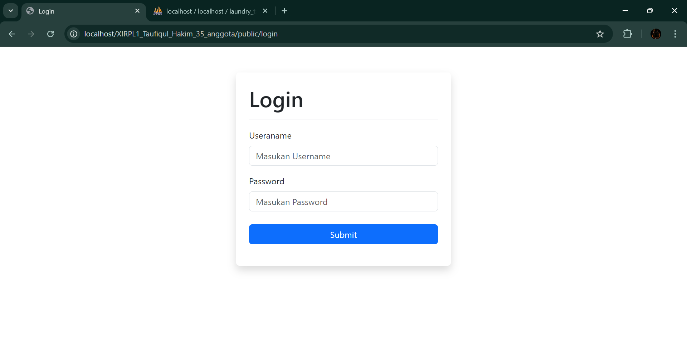
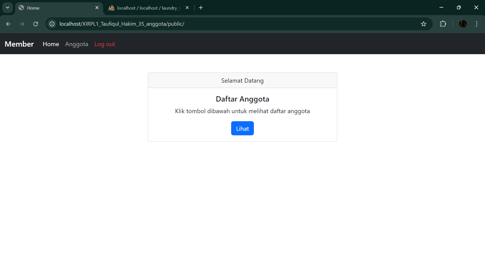
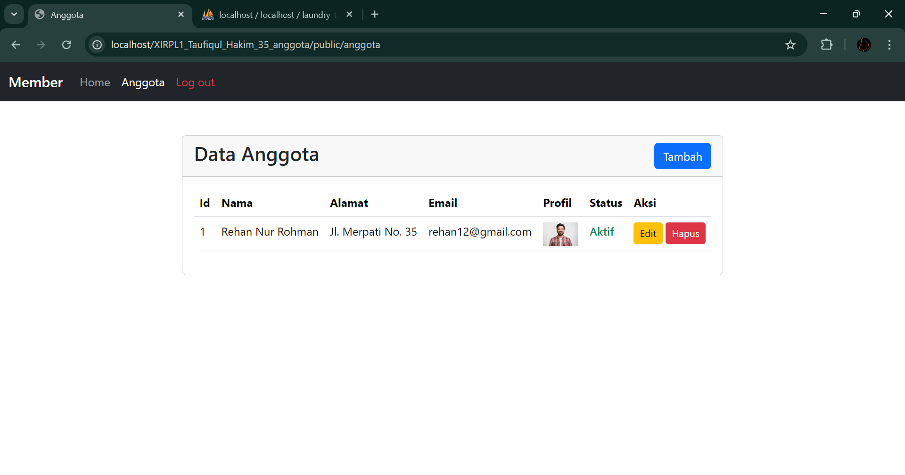

# 📚 Sistem CRUD Anggota

"Untuk memenuhi salah satu tugas dari KK RPL"

Aplikasi ini dibuat sebagai contoh sederhana dari sistem CRUD (Create, Read, Update, Delete) untuk mengelola data anggota.  
Project ini memiliki fitur login sederhana dan halaman utama sebelum pengguna dapat mengakses data anggota.

---

## 🖥 Preview Tampilan

> (Ganti link/filename sesuai screenshot yang kamu punya)

| Login | Home | Data Anggota |
|-------|------|--------------|
|  |  |  |

---

## ⚙ Fitur Utama

✔ Login  
✔ Tampilan Dashboard/Home  
✔ Tambah Data Anggota  
✔ Edit Data Anggota  
✔ Hapus Data Anggota  
✔ Tampilkan seluruh data anggota  

---

## 🧩 Teknologi Yang Digunakan

| Teknologi | Deskripsi |
|----------|-----------|
| PHP | Logic Backend |
| MySQL | Database |
| HTML, CSS(Bootstrap) | Tampilan Frontend |

---
---

## 👤 Pembuat

- Nama: Taufiqul Hakim
- Kelas: XI RPL 1 
- No Absen: 35

---

### 🎯 Project ini dibuat untuk tujuan pembelajaran.

